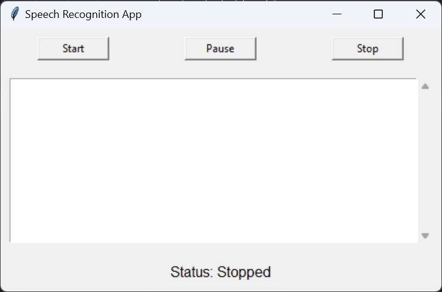

# recordGPT

An innovative voice recording app written in Python that not only captures your conversations but also provides concise and accurate summaries. Perfect for meetings, interviews, or brainstorming sessions, this app ensures you never miss key insights while saving time on note-taking. 

Simply start recording, and let recordGPT generate a summary of your discussion.

